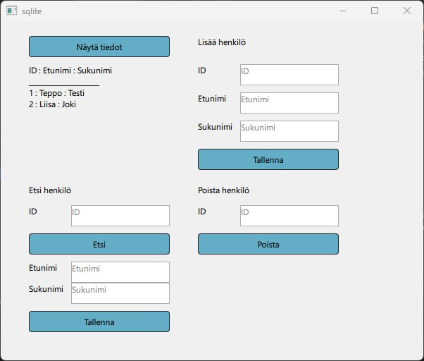

# QML SQLITE Esimerkki

## SQLite tietokanta

Jotta voit käyttää SQLiteä, tarvitset sovelluksen **sqlite3.exe**. Ja sen voit ladata sivulta
https://www.sqlite.org/download.html. Windowsiin asennettaessa tulee valita tiedosto sqlite-tools-...zip.

Kun purat sen saat tiedoston sqlite3.exe. Ja, jos kopioit sen vaikka kansioon c:\sqlite, voit käynnistää sovelluksen komentoriviltä komennolla 
<pre>
c:\sqlite\sqlite3 
</pre>
Voit luoda tietokannan seuraavasti: 
<ol>
<li>Kansiossa <b>temp</b> anna komento <b>c:\sqlite\sqlite3 mydb.db</b>  </li>
<li>Suorita koodi 
<pre>
create table Person(
    id int primary key,
    firstname varchar(30),
    lastname varchar(30)
);
insert into Person values(1,'Teppo','Testi');
insert into Person values(2,'Liisa','Joki');
</pre></li>
</ol>
Nyt sinun pitäisi saada Qt-sovelluksella näkyviin tietokanna tiedot ja lisääminen, poistaminen ja päivitys pitäisi onnistua.

## Qt/QML Sovellus

Sovellus näyttää seuraavalta:

